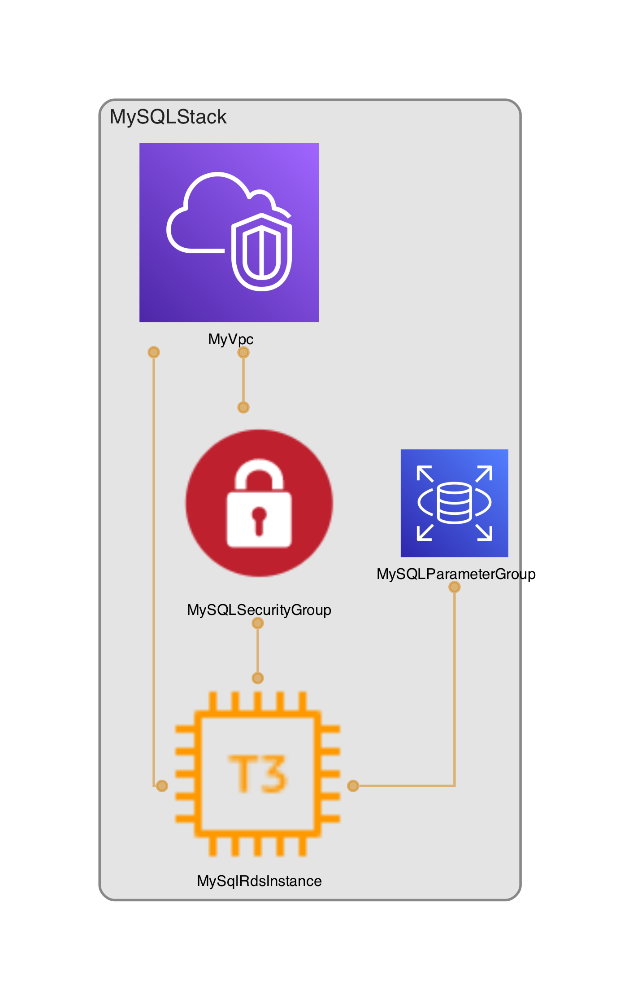

# MySQL RDS Data Integration to SingleStore

Data integration from one database to another is a cumbersome task. There are many considerations such as data integrity and consistency, downtime and performance impact, and schema differences. 

With SingleStore, we announced  earlier this year. One of these services is to create connection links to automatically detect tables and load them in consistently.

This repo contains the code walkthrough the blog: <INSERT_BLOG>.


## Launch Configurations

### Prerequisites

- aws-cli
- aws-cdk >= 2.128.0
- node >= 21.6.1
- npm >= 10.4.0
- git
- jq >= 1.7.1

### Deployment

Run the following command to build and deploy the application. Be sure to setup your AWS account using `aws configure`.

```bash
./scripts/deploy.sh
```

### Teardown

Once you are finished using the project, use the following command to delete the associated resources.

```bash
./scripts/teardown.sh
```

## Architecture Overview

### Code Layout

| Path                 | Description                                                    |
| :------------------- | :------------------------------------------------------------- |
| cdk/                 | AWS CDK source code.                                           |
| data/                | RDS data.                                                      |
| scripts/             | shell scripts to build, deploy, and interact with the project. |
| docs/assets/         | supporting assets for documentation.                           |

### AWS Architecture Diagram

