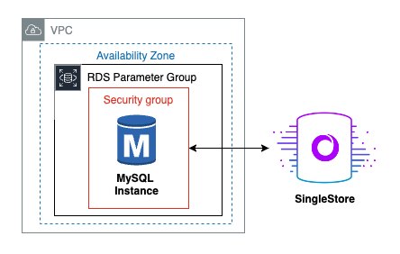

# MySQL RDS Data Integration to SingleStore

Data integration from one database to another is a cumbersome task. There are many considerations such as data integrity and consistency, downtime and performance impact, and schema differences. 

With SingleStore, we announced [native data integration services](https://www.singlestore.com/blog/introducing-native-data-integration-services/) earlier this year. One of these services is to create [connection links](https://docs.singlestore.com/db/v8.7/security/authentication/configuring-and-using-connection-links/) to automatically detect tables and load them in consistently.

A common use case we see with customers like [Medaxion](https://www.singlestore.com/blog/case-study-medaxion-analytics-medtech/) is to migrate from MySQL to SingleStore for increased speed of performance and operational efficiencies.

This blog post walks you through a migration from an Amazon MySQL RDS instance to a SingleStore cluster using this method. 

Don’t have a SingleStore account yet? Sign up [here](https://www.singlestore.com/cloud-trial/?utm_source=kevin-tran).
Don’t have an AWS account? Sign up [here](https://signin.aws.amazon.com/signup?request_type=register).

By the end of this tutorial, you will understand what configurations are needed for conducting this data integration.



## Launch Configurations

### Prerequisites

- git
- aws-cli
- aws-cdk >= 2.128.0
- node >= 21.6.1
- npm >= 10.4.0
- jq >= 1.7.1
- mysql >= 11.4.2

### Deployment

Run the following command to build and deploy the application. Be sure to setup your AWS account using `aws configure`.

```bash
./scripts/deploy.sh
```

### Teardown

Once you are finished using the project, use the following command to delete the associated resources.

```bash
./scripts/teardown.sh
```

## Architecture Overview

### Code Layout

| Path                 | Description                                                    |
| :------------------- | :------------------------------------------------------------- |
| cdk/                 | AWS CDK source code.                                           |
| data/                | RDS data.                                                      |
| scripts/             | shell scripts to build, deploy, and interact with the project. |
| assets/              | supporting pics and diagrams for documentation.                |
